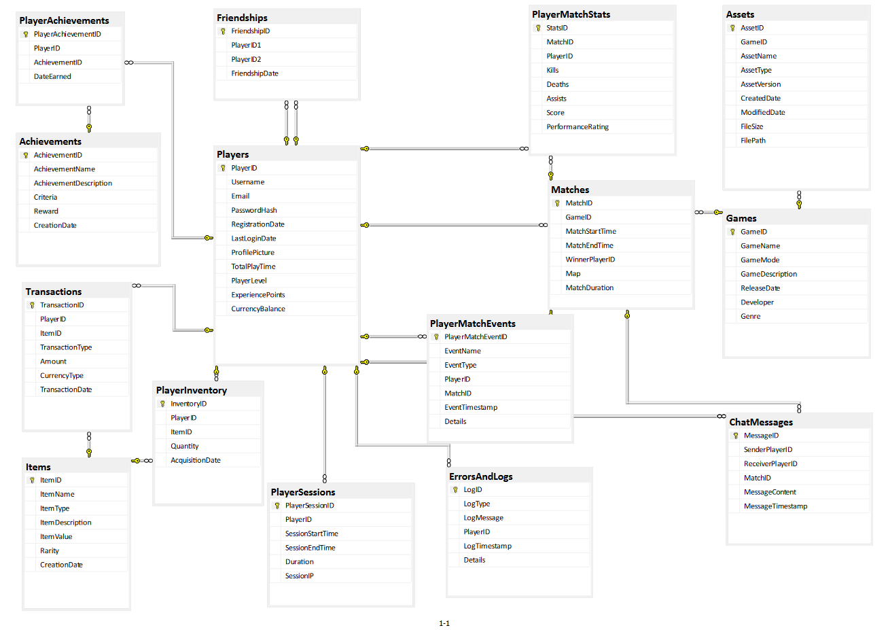

# ArcadiaProject 
 
> **Notice:** This project is currently in development. Expect frequent changes and updates.

**ArcadiaDB** is a comprehensive and open-source SQL Server database designed for game development projects. It integrates various aspects of game development, including multiplayer management, in-game economy, asset management, player statistics, achievements, and analytics. This database is ideal for developers looking to understand or implement complex game systems with a focus on scalability and performance.

## Entity-Relationship Diagram (ERD)
Below is the ER diagram for ArcadiaDB:

## Key Features
- **Multiplayer Management:** Track matches, player statistics, and in-game events.
- **In-Game Economy:** Manage player inventories, transactions, and item rarity.
- **Asset Management:** Store and version control game assets like models, textures, and audio.
- **Player Progression:** Track achievements, player levels, and experience points.
- **Analytics & Logging:** Capture player sessions, error logs, and event-driven data for analysis.

## Technologies Used
- SQL Server
- T-SQL (for stored procedures, triggers, and functions)

## How to Run the Scripts

To set up and run the `ArcadiaDB` database, follow these steps:

### 1. Run `arcadiadb.sql`
This script creates the database and defines all necessary tables, constraints, and initial schema structure.

- Open SQL Server Management Studio (SSMS).
- Connect to your SQL Server instance.
- Open `arcadiadb.sql` in SSMS.
- Execute the script to create the `ArcadiaDB` database and all its tables.

### 2. Run `data.sql`
This script populates the database with sample data, including players, games, matches, and more.

- After running the `arcadiadb.sql` script, open `data.sql` in SSMS.
- Ensure that the `USE ArcadiaDB;` command is present at the beginning of the script.
- Execute the script to insert the sample data into the `ArcadiaDB` database.

### 3. Run `queries_and_automatisation.sql`
This script contains basic and complex queries, stored procedures, triggers, and functions that encapsulate the business logic of the database.

- After populating the database with `data.sql`, open `queries_and_automatisation.sql` in SSMS.
- Ensure that the `USE ArcadiaDB;` command is present at the beginning of the script.
- Execute the script to create and test various queries, stored procedures, triggers, and functions.

### 4. Verify the Setup
After running all the scripts, you can start executing queries and procedures to interact with the `ArcadiaDB` database and verify that everything is functioning as expected.

## License
This project is licensed under the MIT License - see the [LICENSE](LICENSE) file for details.
