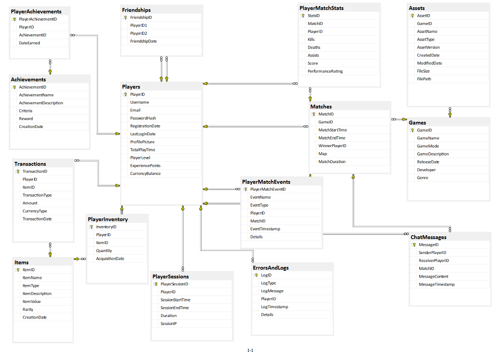

# ArcadiaProject 
 
> **Notice:** This project is currently in development. Expect frequent changes and updates.

**ArcadiaDB** is a comprehensive and open-source SQL Server database designed for game development projects. It integrates various aspects of game development, including multiplayer management, in-game economy, asset management, player statistics, achievements, and analytics. This database is ideal for developers looking to understand or implement complex game systems with a focus on scalability and performance.

## Entity-Relationship Diagram (ERD)
Below is the ER diagram for ArcadiaDB:



## Key Features
- **Multiplayer Management:** Track matches, player statistics, and in-game events.
- **In-Game Economy:** Manage player inventories, transactions, and item rarity.
- **Asset Management:** Store and version control game assets like models, textures, and audio.
- **Player Progression:** Track achievements, player levels, and experience points.
- **Analytics & Logging:** Capture player sessions, error logs, and event-driven data for analysis.

## Technologies Used
- SQL Server
- T-SQL (for stored procedures, triggers, and functions)

## Getting Started

### Prerequisites
- A running **SQL Server** instance (2019+, or Azure SQL Database)
- A client to run the scripts: [SSMS](https://aka.ms/ssms), [Azure Data Studio](https://azure.microsoft.com/products/data-studio), or the `sqlcmd` CLI

### Setup
Run the three scripts **in order** — each depends on the previous:

| # | Script | What it does |
|---|--------|--------------|
| 1 | `sql/arcadiadb.sql` | Creates the `ArcadiaDB` database, tables, keys, and constraints |
| 2 | `sql/data.sql` | Inserts sample data (players, games, matches, items, …) |
| 3 | `sql/queries_and_automatisation.sql` | Adds stored procedures, triggers, functions, and example queries |

In SSMS or Azure Data Studio, open each file and execute it in that sequence. Or from the command line:

```bash
sqlcmd -S localhost -E -i sql/arcadiadb.sql
sqlcmd -S localhost -E -i sql/data.sql
sqlcmd -S localhost -E -i sql/queries_and_automatisation.sql
```
> Use `-U <user> -P <password>` in place of `-E` if you're using SQL Server authentication.

### Verify
```sql
USE ArcadiaDB;
SELECT TOP 5 Username, PlayerLevel, CurrencyBalance FROM Players;
```

## License
This project is licensed under the MIT License - see the [LICENSE](LICENSE) file for details.
